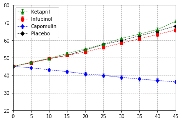
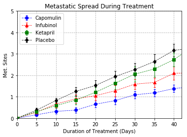
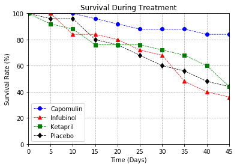
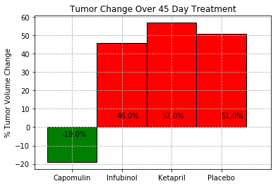
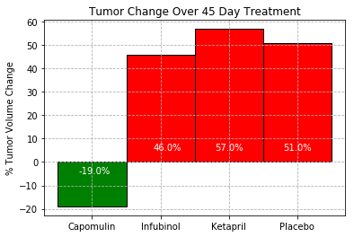

SUMMARY

1. Capomulin was far and away the most effective at reducing tumor volume, in fact it was the only treatment besides Ramicane (not graphed) which actually reduced tumor volume.  The other drugs were effectively the same as the placebo. Ketapril was effectively the worst medication for reducing tumor volume.

2. At suppressing metastatic spread during treatment, Ramicane and Capomulin again were the most effective drugs.  Infubinol was somewhat effective, but Ketabpril had virtually the same effectiveness as the placebo.

3.  Mouse survival rates were highest with Capomulin at 84% at the end of the treatment period.  Ramicane was in a close 2nd.  Ketapril was effectively the same as the Placebo but Infubinol has worse.  Profriva (not graphed) had the worst.


```python
import pandas as pd
import numpy as np
import matplotlib.pyplot as plt

```


```python
clinicaltrial_data = pd.read_csv("clinicaltrial_data.csv")

```


```python
mouse_drug_data = pd.read_csv("mouse_drug_data.csv")


```


```python
merged_df = pd.merge(clinicaltrial_data, mouse_drug_data, on="Mouse ID")
```


```python
#get the mean of each trial as a function of drug and timepoint
av_tumor_volumes_per_drug = merged_df.groupby(["Drug", "Timepoint"]).mean()["Tumor Volume (mm3)"]

# get the stardard error of each mean
standard_error = merged_df.groupby(["Drug", "Timepoint"]).sem()["Tumor Volume (mm3)"]

# Change the table of everage tumor growths per drug into a DF
av_tumor_volumes_per_drug_df = pd.DataFrame(av_tumor_volumes_per_drug)
av_tumor_volumes_per_drug_df.head()
```


<div>
<style scoped>
    .dataframe tbody tr th:only-of-type {
        vertical-align: middle;
    }

    .dataframe tbody tr th {
        vertical-align: top;
    }

    .dataframe thead th {
        text-align: right;
    }
</style>
<table border="1" class="dataframe">
  <thead>
    <tr style="text-align: right;">
      <th></th>
      <th></th>
      <th>Tumor Volume (mm3)</th>
    </tr>
    <tr>
      <th>Drug</th>
      <th>Timepoint</th>
      <th></th>
    </tr>
  </thead>
  <tbody>
    <tr>
      <th rowspan="5" valign="top">Capomulin</th>
      <th>0</th>
      <td>45.000000</td>
    </tr>
    <tr>
      <th>5</th>
      <td>44.266086</td>
    </tr>
    <tr>
      <th>10</th>
      <td>43.084291</td>
    </tr>
    <tr>
      <th>15</th>
      <td>42.064317</td>
    </tr>
    <tr>
      <th>20</th>
      <td>40.716325</td>
    </tr>
  </tbody>
</table>
</div>


```python
# reset indexes
av_volumes_per_drug__reset_df = av_tumor_volumes_per_drug_df.reset_index()

```


```python
# Create pivot table
drugs_pivot_df = av_volumes_per_drug__reset_df.pivot(index="Timepoint", columns='Drug', values='Tumor Volume (mm3)')
drugs_pivot_df
```


<div>
<style scoped>
    .dataframe tbody tr th:only-of-type {
        vertical-align: middle;
    }

    .dataframe tbody tr th {
        vertical-align: top;
    }

    .dataframe thead th {
        text-align: right;
    }
</style>
<table border="1" class="dataframe">
  <thead>
    <tr style="text-align: right;">
      <th>Drug</th>
      <th>Capomulin</th>
      <th>Ceftamin</th>
      <th>Infubinol</th>
      <th>Ketapril</th>
      <th>Naftisol</th>
      <th>Placebo</th>
      <th>Propriva</th>
      <th>Ramicane</th>
      <th>Stelasyn</th>
      <th>Zoniferol</th>
    </tr>
    <tr>
      <th>Timepoint</th>
      <th></th>
      <th></th>
      <th></th>
      <th></th>
      <th></th>
      <th></th>
      <th></th>
      <th></th>
      <th></th>
      <th></th>
    </tr>
  </thead>
  <tbody>
    <tr>
      <th>0</th>
      <td>45.000000</td>
      <td>45.000000</td>
      <td>45.000000</td>
      <td>45.000000</td>
      <td>45.000000</td>
      <td>45.000000</td>
      <td>45.000000</td>
      <td>45.000000</td>
      <td>45.000000</td>
      <td>45.000000</td>
    </tr>
    <tr>
      <th>5</th>
      <td>44.266086</td>
      <td>46.503051</td>
      <td>47.062001</td>
      <td>47.389175</td>
      <td>46.796098</td>
      <td>47.125589</td>
      <td>47.248967</td>
      <td>43.944859</td>
      <td>47.527452</td>
      <td>46.851818</td>
    </tr>
    <tr>
      <th>10</th>
      <td>43.084291</td>
      <td>48.285125</td>
      <td>49.403909</td>
      <td>49.582269</td>
      <td>48.694210</td>
      <td>49.423329</td>
      <td>49.101541</td>
      <td>42.531957</td>
      <td>49.463844</td>
      <td>48.689881</td>
    </tr>
    <tr>
      <th>15</th>
      <td>42.064317</td>
      <td>50.094055</td>
      <td>51.296397</td>
      <td>52.399974</td>
      <td>50.933018</td>
      <td>51.359742</td>
      <td>51.067318</td>
      <td>41.495061</td>
      <td>51.529409</td>
      <td>50.779059</td>
    </tr>
    <tr>
      <th>20</th>
      <td>40.716325</td>
      <td>52.157049</td>
      <td>53.197691</td>
      <td>54.920935</td>
      <td>53.644087</td>
      <td>54.364417</td>
      <td>53.346737</td>
      <td>40.238325</td>
      <td>54.067395</td>
      <td>53.170334</td>
    </tr>
    <tr>
      <th>25</th>
      <td>39.939528</td>
      <td>54.287674</td>
      <td>55.715252</td>
      <td>57.678982</td>
      <td>56.731968</td>
      <td>57.482574</td>
      <td>55.504138</td>
      <td>38.974300</td>
      <td>56.166123</td>
      <td>55.432935</td>
    </tr>
    <tr>
      <th>30</th>
      <td>38.769339</td>
      <td>56.769517</td>
      <td>58.299397</td>
      <td>60.994507</td>
      <td>59.559509</td>
      <td>59.809063</td>
      <td>58.196374</td>
      <td>38.703137</td>
      <td>59.826738</td>
      <td>57.713531</td>
    </tr>
    <tr>
      <th>35</th>
      <td>37.816839</td>
      <td>58.827548</td>
      <td>60.742461</td>
      <td>63.371686</td>
      <td>62.685087</td>
      <td>62.420615</td>
      <td>60.350199</td>
      <td>37.451996</td>
      <td>62.440699</td>
      <td>60.089372</td>
    </tr>
    <tr>
      <th>40</th>
      <td>36.958001</td>
      <td>61.467895</td>
      <td>63.162824</td>
      <td>66.068580</td>
      <td>65.600754</td>
      <td>65.052675</td>
      <td>63.045537</td>
      <td>36.574081</td>
      <td>65.356386</td>
      <td>62.916692</td>
    </tr>
    <tr>
      <th>45</th>
      <td>36.236114</td>
      <td>64.132421</td>
      <td>65.755562</td>
      <td>70.662958</td>
      <td>69.265506</td>
      <td>68.084082</td>
      <td>66.258529</td>
      <td>34.955595</td>
      <td>68.438310</td>
      <td>65.960888</td>
    </tr>
  </tbody>
</table>
</div>


## Creating a scatter plot that shows how the tumor volume changes over time for each treatment.


```python
#Make a plot for each drug as a function of Timepoint
```


```python
# plot the Placebo
x = drugs_pivot_df.index
y = drugs_pivot_df["Placebo"]
yerr = standard_error["Placebo"]
placebo_volume_plot_sem = plt.errorbar(x, y, yerr=yerr, color="black", ecolor="black",marker="o", linestyle="dashed", linewidth=0.8)


# plot Capomulin
x = drugs_pivot_df.index
y = drugs_pivot_df["Capomulin"]
yerr = standard_error["Capomulin"]
capomulin_volume_plot_sem = plt.errorbar(x, y, yerr=yerr, color="b", ecolor="b",marker="d", linestyle="dashed", linewidth=0.8, capsize=2)


# plot Infubinol
x = drugs_pivot_df.index
y = drugs_pivot_df["Infubinol"]
yerr = standard_error["Infubinol"]
infubinol_volume_plot_sem = plt.errorbar(x, y, yerr=yerr, color="r", ecolor="r", marker="s", linestyle="dashed", linewidth=0.8, capsize=2)


# plot Ketapril
x = drugs_pivot_df.index
y = drugs_pivot_df["Ketapril"]
yerr = standard_error["Ketapril"]
ketapril_volume_plot_sem = plt.errorbar(x, y, yerr=yerr, color="g", ecolor="g", marker="^", linestyle="dashed", linewidth=0.8, capsize=2)


#set limits
plt.ylim(20, 80)
plt.xlim(0, 45)
# Create a legend for our chart
plt.legend(handles=[ketapril_volume_plot_sem,infubinol_volume_plot_sem,capomulin_volume_plot_sem, placebo_volume_plot_sem], loc="best")

plt.grid(b=True, linestyle="dashed")
plt.show()
```





# Creating a scatter plot that shows how the number of [metastatic] sites changes over time for each treatment.


```python
merged_df.head()
```


<div>
<style scoped>
    .dataframe tbody tr th:only-of-type {
        vertical-align: middle;
    }

    .dataframe tbody tr th {
        vertical-align: top;
    }

    .dataframe thead th {
        text-align: right;
    }
</style>
<table border="1" class="dataframe">
  <thead>
    <tr style="text-align: right;">
      <th></th>
      <th>Mouse ID</th>
      <th>Timepoint</th>
      <th>Tumor Volume (mm3)</th>
      <th>Metastatic Sites</th>
      <th>Drug</th>
    </tr>
  </thead>
  <tbody>
    <tr>
      <th>0</th>
      <td>b128</td>
      <td>0</td>
      <td>45.000000</td>
      <td>0</td>
      <td>Capomulin</td>
    </tr>
    <tr>
      <th>1</th>
      <td>b128</td>
      <td>5</td>
      <td>45.651331</td>
      <td>0</td>
      <td>Capomulin</td>
    </tr>
    <tr>
      <th>2</th>
      <td>b128</td>
      <td>10</td>
      <td>43.270852</td>
      <td>0</td>
      <td>Capomulin</td>
    </tr>
    <tr>
      <th>3</th>
      <td>b128</td>
      <td>15</td>
      <td>43.784893</td>
      <td>0</td>
      <td>Capomulin</td>
    </tr>
    <tr>
      <th>4</th>
      <td>b128</td>
      <td>20</td>
      <td>42.731552</td>
      <td>0</td>
      <td>Capomulin</td>
    </tr>
  </tbody>
</table>
</div>


```python
# Find the average number of metastatic sites as a function of Timepoint and treatment
av_sites_per_drug = merged_df.groupby(["Drug", "Timepoint"]).mean()["Metastatic Sites"]
av_sites_per_drug_df = pd.DataFrame(av_sites_per_drug)
av_sites_per_drug_df.head()
```


<div>
<style scoped>
    .dataframe tbody tr th:only-of-type {
        vertical-align: middle;
    }

    .dataframe tbody tr th {
        vertical-align: top;
    }

    .dataframe thead th {
        text-align: right;
    }
</style>
<table border="1" class="dataframe">
  <thead>
    <tr style="text-align: right;">
      <th></th>
      <th></th>
      <th>Metastatic Sites</th>
    </tr>
    <tr>
      <th>Drug</th>
      <th>Timepoint</th>
      <th></th>
    </tr>
  </thead>
  <tbody>
    <tr>
      <th rowspan="5" valign="top">Capomulin</th>
      <th>0</th>
      <td>0.000000</td>
    </tr>
    <tr>
      <th>5</th>
      <td>0.160000</td>
    </tr>
    <tr>
      <th>10</th>
      <td>0.320000</td>
    </tr>
    <tr>
      <th>15</th>
      <td>0.375000</td>
    </tr>
    <tr>
      <th>20</th>
      <td>0.652174</td>
    </tr>
  </tbody>
</table>
</div>


```python
# Calculate standard error
av_sites_sem = merged_df.groupby(["Drug", "Timepoint"]).sem()["Metastatic Sites"]
av_sites_sem_df = pd.DataFrame(av_sites_sem)
av_sites_sem_df.head()
```


<div>
<style scoped>
    .dataframe tbody tr th:only-of-type {
        vertical-align: middle;
    }

    .dataframe tbody tr th {
        vertical-align: top;
    }

    .dataframe thead th {
        text-align: right;
    }
</style>
<table border="1" class="dataframe">
  <thead>
    <tr style="text-align: right;">
      <th></th>
      <th></th>
      <th>Metastatic Sites</th>
    </tr>
    <tr>
      <th>Drug</th>
      <th>Timepoint</th>
      <th></th>
    </tr>
  </thead>
  <tbody>
    <tr>
      <th rowspan="5" valign="top">Capomulin</th>
      <th>0</th>
      <td>0.000000</td>
    </tr>
    <tr>
      <th>5</th>
      <td>0.074833</td>
    </tr>
    <tr>
      <th>10</th>
      <td>0.125433</td>
    </tr>
    <tr>
      <th>15</th>
      <td>0.132048</td>
    </tr>
    <tr>
      <th>20</th>
      <td>0.161621</td>
    </tr>
  </tbody>
</table>
</div>


```python
# reset indexes
av_sites_per_drug_reset_df = av_sites_per_drug_df.reset_index()
```


```python
# Create pivot table
sites_pivot_df = av_sites_per_drug_reset_df.pivot(index="Timepoint", columns='Drug', values='Metastatic Sites')
sites_pivot_df
```


<div>
<style scoped>
    .dataframe tbody tr th:only-of-type {
        vertical-align: middle;
    }

    .dataframe tbody tr th {
        vertical-align: top;
    }

    .dataframe thead th {
        text-align: right;
    }
</style>
<table border="1" class="dataframe">
  <thead>
    <tr style="text-align: right;">
      <th>Drug</th>
      <th>Capomulin</th>
      <th>Ceftamin</th>
      <th>Infubinol</th>
      <th>Ketapril</th>
      <th>Naftisol</th>
      <th>Placebo</th>
      <th>Propriva</th>
      <th>Ramicane</th>
      <th>Stelasyn</th>
      <th>Zoniferol</th>
    </tr>
    <tr>
      <th>Timepoint</th>
      <th></th>
      <th></th>
      <th></th>
      <th></th>
      <th></th>
      <th></th>
      <th></th>
      <th></th>
      <th></th>
      <th></th>
    </tr>
  </thead>
  <tbody>
    <tr>
      <th>0</th>
      <td>0.000000</td>
      <td>0.000000</td>
      <td>0.000000</td>
      <td>0.000000</td>
      <td>0.000000</td>
      <td>0.000000</td>
      <td>0.000000</td>
      <td>0.000000</td>
      <td>0.000000</td>
      <td>0.000000</td>
    </tr>
    <tr>
      <th>5</th>
      <td>0.160000</td>
      <td>0.380952</td>
      <td>0.280000</td>
      <td>0.304348</td>
      <td>0.260870</td>
      <td>0.375000</td>
      <td>0.320000</td>
      <td>0.120000</td>
      <td>0.240000</td>
      <td>0.166667</td>
    </tr>
    <tr>
      <th>10</th>
      <td>0.320000</td>
      <td>0.600000</td>
      <td>0.666667</td>
      <td>0.590909</td>
      <td>0.523810</td>
      <td>0.833333</td>
      <td>0.565217</td>
      <td>0.250000</td>
      <td>0.478261</td>
      <td>0.500000</td>
    </tr>
    <tr>
      <th>15</th>
      <td>0.375000</td>
      <td>0.789474</td>
      <td>0.904762</td>
      <td>0.842105</td>
      <td>0.857143</td>
      <td>1.250000</td>
      <td>0.764706</td>
      <td>0.333333</td>
      <td>0.782609</td>
      <td>0.809524</td>
    </tr>
    <tr>
      <th>20</th>
      <td>0.652174</td>
      <td>1.111111</td>
      <td>1.050000</td>
      <td>1.210526</td>
      <td>1.150000</td>
      <td>1.526316</td>
      <td>1.000000</td>
      <td>0.347826</td>
      <td>0.952381</td>
      <td>1.294118</td>
    </tr>
    <tr>
      <th>25</th>
      <td>0.818182</td>
      <td>1.500000</td>
      <td>1.277778</td>
      <td>1.631579</td>
      <td>1.500000</td>
      <td>1.941176</td>
      <td>1.357143</td>
      <td>0.652174</td>
      <td>1.157895</td>
      <td>1.687500</td>
    </tr>
    <tr>
      <th>30</th>
      <td>1.090909</td>
      <td>1.937500</td>
      <td>1.588235</td>
      <td>2.055556</td>
      <td>2.066667</td>
      <td>2.266667</td>
      <td>1.615385</td>
      <td>0.782609</td>
      <td>1.388889</td>
      <td>1.933333</td>
    </tr>
    <tr>
      <th>35</th>
      <td>1.181818</td>
      <td>2.071429</td>
      <td>1.666667</td>
      <td>2.294118</td>
      <td>2.266667</td>
      <td>2.642857</td>
      <td>2.300000</td>
      <td>0.952381</td>
      <td>1.562500</td>
      <td>2.285714</td>
    </tr>
    <tr>
      <th>40</th>
      <td>1.380952</td>
      <td>2.357143</td>
      <td>2.100000</td>
      <td>2.733333</td>
      <td>2.466667</td>
      <td>3.166667</td>
      <td>2.777778</td>
      <td>1.100000</td>
      <td>1.583333</td>
      <td>2.785714</td>
    </tr>
    <tr>
      <th>45</th>
      <td>1.476190</td>
      <td>2.692308</td>
      <td>2.111111</td>
      <td>3.363636</td>
      <td>2.538462</td>
      <td>3.272727</td>
      <td>2.571429</td>
      <td>1.250000</td>
      <td>1.727273</td>
      <td>3.071429</td>
    </tr>
  </tbody>
</table>
</div>


```python
# plot the Placebo
x = sites_pivot_df.index
y = sites_pivot_df["Placebo"]
yerr = av_sites_sem["Placebo"]
placebo_sem_sites_plot = plt.errorbar(x, y, yerr=yerr, marker="d",color="black", ecolor="black",elinewidth=1, linestyle="dashed", linewidth=0.8, capsize=2)


# plot the average sites for Capomulin
x = sites_pivot_df.index
y = sites_pivot_df["Capomulin"]
yerr = av_sites_sem["Capomulin"]
capomulin_sem_sites_plot = plt.errorbar(x, y, yerr=yerr, color="b", ecolor="b", marker="o",elinewidth=1, linestyle="dashed", linewidth=0.8, capsize=2)


# plot the average sites for Infubinol
x = sites_pivot_df.index
y = sites_pivot_df["Infubinol"]
yerr = av_sites_sem["Infubinol"]
infubinol_sem_sites_plot = plt.errorbar(x, y, yerr=yerr, color="r", ecolor="r",marker="^",elinewidth=1 ,linestyle="dashed", linewidth=0.8, capsize=2)


# plot the average sites for Ketapril
x = sites_pivot_df.index
y = sites_pivot_df["Ketapril"]
yerr = av_sites_sem["Ketapril"]
ketapril_sem_sites_plot = plt.errorbar(x, y, yerr=yerr, color="g", ecolor="g",marker="s",elinewidth=1, linestyle="dashed", linewidth=0.8, capsize=2)


# plot the legend
plt.legend(handles=[capomulin_sem_sites_plot,infubinol_sem_sites_plot,ketapril_sem_sites_plot,placebo_sem_sites_plot], loc="best")

plt.title("Metastatic Spread During Treatment")
plt.xlabel("Duration of Treatment (Days)")
plt.ylabel("Met. Sites")
plt.grid(b=True, linestyle="dashed")
plt.ylim(0, 5)
plt.xlim(0, 42)
plt.show()
```





Capomulin was the most effective drug at suppressing metastatic spread during treatment.  Infubinol was somewhat effective, but Ketabpril was not much more effective than the placebo.

# Survival Rates


```python
merged_df.head()
```


<div>
<style scoped>
    .dataframe tbody tr th:only-of-type {
        vertical-align: middle;
    }

    .dataframe tbody tr th {
        vertical-align: top;
    }

    .dataframe thead th {
        text-align: right;
    }
</style>
<table border="1" class="dataframe">
  <thead>
    <tr style="text-align: right;">
      <th></th>
      <th>Mouse ID</th>
      <th>Timepoint</th>
      <th>Tumor Volume (mm3)</th>
      <th>Metastatic Sites</th>
      <th>Drug</th>
    </tr>
  </thead>
  <tbody>
    <tr>
      <th>0</th>
      <td>b128</td>
      <td>0</td>
      <td>45.000000</td>
      <td>0</td>
      <td>Capomulin</td>
    </tr>
    <tr>
      <th>1</th>
      <td>b128</td>
      <td>5</td>
      <td>45.651331</td>
      <td>0</td>
      <td>Capomulin</td>
    </tr>
    <tr>
      <th>2</th>
      <td>b128</td>
      <td>10</td>
      <td>43.270852</td>
      <td>0</td>
      <td>Capomulin</td>
    </tr>
    <tr>
      <th>3</th>
      <td>b128</td>
      <td>15</td>
      <td>43.784893</td>
      <td>0</td>
      <td>Capomulin</td>
    </tr>
    <tr>
      <th>4</th>
      <td>b128</td>
      <td>20</td>
      <td>42.731552</td>
      <td>0</td>
      <td>Capomulin</td>
    </tr>
  </tbody>
</table>
</div>


```python
# caluculate the number of mice as a function of teh drug and timepoints
mouse_count = merged_df.groupby(["Drug", "Timepoint"]).count()["Mouse ID"]
mouse_count_df = pd.DataFrame(survivors)

# Rename Mouse ID to Mouse Count
mouse_count_df_renamed = survivors_df.rename(columns={"Mouse ID": "Mouse Counts"})
mouse_count_df_renamed.head()

```


<div>
<style scoped>
    .dataframe tbody tr th:only-of-type {
        vertical-align: middle;
    }

    .dataframe tbody tr th {
        vertical-align: top;
    }

    .dataframe thead th {
        text-align: right;
    }
</style>
<table border="1" class="dataframe">
  <thead>
    <tr style="text-align: right;">
      <th></th>
      <th></th>
      <th>Mouse Counts</th>
    </tr>
    <tr>
      <th>Drug</th>
      <th>Timepoint</th>
      <th></th>
    </tr>
  </thead>
  <tbody>
    <tr>
      <th rowspan="5" valign="top">Capomulin</th>
      <th>0</th>
      <td>25</td>
    </tr>
    <tr>
      <th>5</th>
      <td>25</td>
    </tr>
    <tr>
      <th>10</th>
      <td>25</td>
    </tr>
    <tr>
      <th>15</th>
      <td>24</td>
    </tr>
    <tr>
      <th>20</th>
      <td>23</td>
    </tr>
  </tbody>
</table>
</div>


```python
# reset indexes
mouse_count_df_reset = mouse_count_df_renamed.reset_index()
```


```python
# Pivot table
mouse_count_pivot_df = mouse_count_df_reset.pivot(index="Timepoint", columns='Drug', values='Mouse Counts')
mouse_count_pivot_df
```


<div>
<style scoped>
    .dataframe tbody tr th:only-of-type {
        vertical-align: middle;
    }

    .dataframe tbody tr th {
        vertical-align: top;
    }

    .dataframe thead th {
        text-align: right;
    }
</style>
<table border="1" class="dataframe">
  <thead>
    <tr style="text-align: right;">
      <th>Drug</th>
      <th>Capomulin</th>
      <th>Ceftamin</th>
      <th>Infubinol</th>
      <th>Ketapril</th>
      <th>Naftisol</th>
      <th>Placebo</th>
      <th>Propriva</th>
      <th>Ramicane</th>
      <th>Stelasyn</th>
      <th>Zoniferol</th>
    </tr>
    <tr>
      <th>Timepoint</th>
      <th></th>
      <th></th>
      <th></th>
      <th></th>
      <th></th>
      <th></th>
      <th></th>
      <th></th>
      <th></th>
      <th></th>
    </tr>
  </thead>
  <tbody>
    <tr>
      <th>0</th>
      <td>25</td>
      <td>25</td>
      <td>25</td>
      <td>25</td>
      <td>25</td>
      <td>25</td>
      <td>26</td>
      <td>25</td>
      <td>26</td>
      <td>25</td>
    </tr>
    <tr>
      <th>5</th>
      <td>25</td>
      <td>21</td>
      <td>25</td>
      <td>23</td>
      <td>23</td>
      <td>24</td>
      <td>25</td>
      <td>25</td>
      <td>25</td>
      <td>24</td>
    </tr>
    <tr>
      <th>10</th>
      <td>25</td>
      <td>20</td>
      <td>21</td>
      <td>22</td>
      <td>21</td>
      <td>24</td>
      <td>23</td>
      <td>24</td>
      <td>23</td>
      <td>22</td>
    </tr>
    <tr>
      <th>15</th>
      <td>24</td>
      <td>19</td>
      <td>21</td>
      <td>19</td>
      <td>21</td>
      <td>20</td>
      <td>17</td>
      <td>24</td>
      <td>23</td>
      <td>21</td>
    </tr>
    <tr>
      <th>20</th>
      <td>23</td>
      <td>18</td>
      <td>20</td>
      <td>19</td>
      <td>20</td>
      <td>19</td>
      <td>17</td>
      <td>23</td>
      <td>21</td>
      <td>17</td>
    </tr>
    <tr>
      <th>25</th>
      <td>22</td>
      <td>18</td>
      <td>18</td>
      <td>19</td>
      <td>18</td>
      <td>17</td>
      <td>14</td>
      <td>23</td>
      <td>19</td>
      <td>16</td>
    </tr>
    <tr>
      <th>30</th>
      <td>22</td>
      <td>16</td>
      <td>17</td>
      <td>18</td>
      <td>15</td>
      <td>15</td>
      <td>13</td>
      <td>23</td>
      <td>18</td>
      <td>15</td>
    </tr>
    <tr>
      <th>35</th>
      <td>22</td>
      <td>14</td>
      <td>12</td>
      <td>17</td>
      <td>15</td>
      <td>14</td>
      <td>10</td>
      <td>21</td>
      <td>16</td>
      <td>14</td>
    </tr>
    <tr>
      <th>40</th>
      <td>21</td>
      <td>14</td>
      <td>10</td>
      <td>15</td>
      <td>15</td>
      <td>12</td>
      <td>9</td>
      <td>20</td>
      <td>12</td>
      <td>14</td>
    </tr>
    <tr>
      <th>45</th>
      <td>21</td>
      <td>13</td>
      <td>9</td>
      <td>11</td>
      <td>13</td>
      <td>11</td>
      <td>7</td>
      <td>20</td>
      <td>11</td>
      <td>14</td>
    </tr>
  </tbody>
</table>
</div>


```python
# Calculate survival percentages at the timepoints

Capomulin_percents = 100 * mouse_count_pivot_df["Capomulin"]/mouse_count_pivot_df["Capomulin"].iloc[0]
Capomulin_percents

placebo_percent = 100 * mouse_count_pivot_df["Placebo"]/mouse_count_pivot_df["Placebo"].iloc[0] 

propriva_percent = 100 * mouse_count_pivot_df["Propriva"] / mouse_count_pivot_df["Propriva"].iloc[0]

Infubinol_percent = 100 * mouse_count_pivot_df["Infubinol"] / mouse_count_pivot_df["Infubinol"].iloc[0]

Ketapril_percent = 100 * mouse_count_pivot_df["Ketapril"] / mouse_count_pivot_df["Ketapril"].iloc[0]

```


```python
survival_rates_df = pd.DataFrame({"Capomulin": Capomulin_percents, "Placebo": placebo_percent, "Infubinol": Infubinol_percent, "Ketapril": Ketapril_percent})
survival_rates_df
```


<div>
<style scoped>
    .dataframe tbody tr th:only-of-type {
        vertical-align: middle;
    }

    .dataframe tbody tr th {
        vertical-align: top;
    }

    .dataframe thead th {
        text-align: right;
    }
</style>
<table border="1" class="dataframe">
  <thead>
    <tr style="text-align: right;">
      <th></th>
      <th>Capomulin</th>
      <th>Infubinol</th>
      <th>Ketapril</th>
      <th>Placebo</th>
    </tr>
    <tr>
      <th>Timepoint</th>
      <th></th>
      <th></th>
      <th></th>
      <th></th>
    </tr>
  </thead>
  <tbody>
    <tr>
      <th>0</th>
      <td>100.0</td>
      <td>100.0</td>
      <td>100.0</td>
      <td>100.0</td>
    </tr>
    <tr>
      <th>5</th>
      <td>100.0</td>
      <td>100.0</td>
      <td>92.0</td>
      <td>96.0</td>
    </tr>
    <tr>
      <th>10</th>
      <td>100.0</td>
      <td>84.0</td>
      <td>88.0</td>
      <td>96.0</td>
    </tr>
    <tr>
      <th>15</th>
      <td>96.0</td>
      <td>84.0</td>
      <td>76.0</td>
      <td>80.0</td>
    </tr>
    <tr>
      <th>20</th>
      <td>92.0</td>
      <td>80.0</td>
      <td>76.0</td>
      <td>76.0</td>
    </tr>
    <tr>
      <th>25</th>
      <td>88.0</td>
      <td>72.0</td>
      <td>76.0</td>
      <td>68.0</td>
    </tr>
    <tr>
      <th>30</th>
      <td>88.0</td>
      <td>68.0</td>
      <td>72.0</td>
      <td>60.0</td>
    </tr>
    <tr>
      <th>35</th>
      <td>88.0</td>
      <td>48.0</td>
      <td>68.0</td>
      <td>56.0</td>
    </tr>
    <tr>
      <th>40</th>
      <td>84.0</td>
      <td>40.0</td>
      <td>60.0</td>
      <td>48.0</td>
    </tr>
    <tr>
      <th>45</th>
      <td>84.0</td>
      <td>36.0</td>
      <td>44.0</td>
      <td>44.0</td>
    </tr>
  </tbody>
</table>
</div>


```python
# plot the Placebo, no yerr since there is no error
x = survival_rates_df.index
y = survival_rates_df["Placebo"]
placebo_survival_plot = plt.errorbar(x, y, marker="d",linestyle="dashed", linewidth=0.8, color="black", ecolor="black")

# plot Capomulin
x = survival_rates_df.index
y = survival_rates_df["Capomulin"]
capomulin_survival_plot = plt.errorbar(x, y, marker="o",color="b", ecolor="b",linestyle="dashed", linewidth=0.8)


# plot Infubinol
x = survival_rates_df.index
y = survival_rates_df["Infubinol"]
infubinol_survival_plot = plt.errorbar(x, y, marker="^", color="r", ecolor="r", linestyle="dashed", linewidth=0.8)

# plot survival rates for Ketapril
x = survival_rates_df.index
y = survival_rates_df["Ketapril"]
ketapril_survival_plot = plt.errorbar(x, y, marker="s", color="g", ecolor="g", linestyle="dashed", linewidth=0.8)

plt.legend(handles=[capomulin_survival_plot,infubinol_survival_plot,ketapril_survival_plot, placebo_survival_plot], loc="best")

plt.title("Survival During Treatment")
plt.xlabel("Time (Days)")
plt.ylabel("Survival Rate (%)")
plt.grid(b=True, linestyle = "dashed")
plt.ylim(0, 100)
plt.xlim(0, 45)
plt.show()
```





## Summary Bar Graph


```python
drugs_pivot_df
```


<div>
<style scoped>
    .dataframe tbody tr th:only-of-type {
        vertical-align: middle;
    }

    .dataframe tbody tr th {
        vertical-align: top;
    }

    .dataframe thead th {
        text-align: right;
    }
</style>
<table border="1" class="dataframe">
  <thead>
    <tr style="text-align: right;">
      <th>Drug</th>
      <th>Capomulin</th>
      <th>Ceftamin</th>
      <th>Infubinol</th>
      <th>Ketapril</th>
      <th>Naftisol</th>
      <th>Placebo</th>
      <th>Propriva</th>
      <th>Ramicane</th>
      <th>Stelasyn</th>
      <th>Zoniferol</th>
    </tr>
    <tr>
      <th>Timepoint</th>
      <th></th>
      <th></th>
      <th></th>
      <th></th>
      <th></th>
      <th></th>
      <th></th>
      <th></th>
      <th></th>
      <th></th>
    </tr>
  </thead>
  <tbody>
    <tr>
      <th>0</th>
      <td>45.000000</td>
      <td>45.000000</td>
      <td>45.000000</td>
      <td>45.000000</td>
      <td>45.000000</td>
      <td>45.000000</td>
      <td>45.000000</td>
      <td>45.000000</td>
      <td>45.000000</td>
      <td>45.000000</td>
    </tr>
    <tr>
      <th>5</th>
      <td>44.266086</td>
      <td>46.503051</td>
      <td>47.062001</td>
      <td>47.389175</td>
      <td>46.796098</td>
      <td>47.125589</td>
      <td>47.248967</td>
      <td>43.944859</td>
      <td>47.527452</td>
      <td>46.851818</td>
    </tr>
    <tr>
      <th>10</th>
      <td>43.084291</td>
      <td>48.285125</td>
      <td>49.403909</td>
      <td>49.582269</td>
      <td>48.694210</td>
      <td>49.423329</td>
      <td>49.101541</td>
      <td>42.531957</td>
      <td>49.463844</td>
      <td>48.689881</td>
    </tr>
    <tr>
      <th>15</th>
      <td>42.064317</td>
      <td>50.094055</td>
      <td>51.296397</td>
      <td>52.399974</td>
      <td>50.933018</td>
      <td>51.359742</td>
      <td>51.067318</td>
      <td>41.495061</td>
      <td>51.529409</td>
      <td>50.779059</td>
    </tr>
    <tr>
      <th>20</th>
      <td>40.716325</td>
      <td>52.157049</td>
      <td>53.197691</td>
      <td>54.920935</td>
      <td>53.644087</td>
      <td>54.364417</td>
      <td>53.346737</td>
      <td>40.238325</td>
      <td>54.067395</td>
      <td>53.170334</td>
    </tr>
    <tr>
      <th>25</th>
      <td>39.939528</td>
      <td>54.287674</td>
      <td>55.715252</td>
      <td>57.678982</td>
      <td>56.731968</td>
      <td>57.482574</td>
      <td>55.504138</td>
      <td>38.974300</td>
      <td>56.166123</td>
      <td>55.432935</td>
    </tr>
    <tr>
      <th>30</th>
      <td>38.769339</td>
      <td>56.769517</td>
      <td>58.299397</td>
      <td>60.994507</td>
      <td>59.559509</td>
      <td>59.809063</td>
      <td>58.196374</td>
      <td>38.703137</td>
      <td>59.826738</td>
      <td>57.713531</td>
    </tr>
    <tr>
      <th>35</th>
      <td>37.816839</td>
      <td>58.827548</td>
      <td>60.742461</td>
      <td>63.371686</td>
      <td>62.685087</td>
      <td>62.420615</td>
      <td>60.350199</td>
      <td>37.451996</td>
      <td>62.440699</td>
      <td>60.089372</td>
    </tr>
    <tr>
      <th>40</th>
      <td>36.958001</td>
      <td>61.467895</td>
      <td>63.162824</td>
      <td>66.068580</td>
      <td>65.600754</td>
      <td>65.052675</td>
      <td>63.045537</td>
      <td>36.574081</td>
      <td>65.356386</td>
      <td>62.916692</td>
    </tr>
    <tr>
      <th>45</th>
      <td>36.236114</td>
      <td>64.132421</td>
      <td>65.755562</td>
      <td>70.662958</td>
      <td>69.265506</td>
      <td>68.084082</td>
      <td>66.258529</td>
      <td>34.955595</td>
      <td>68.438310</td>
      <td>65.960888</td>
    </tr>
  </tbody>
</table>
</div>


```python
# Calculate percent change of Capomulin
Capomulin_change = round(100 * ((drugs_pivot_df.iloc[9,0] - drugs_pivot_df.iloc[0,0]) / drugs_pivot_df.iloc[0,0]))
print(Capomulin_change)

# Infubinol percent change
Infubinol_change = round(100 * ((drugs_pivot_df.iloc[9,2] - drugs_pivot_df.iloc[0,2]) / drugs_pivot_df.iloc[0,0]))
print(Infubinol_change)

# Ketapril percent change
Ketapril_change = round(100 * ((drugs_pivot_df.iloc[9,3] - drugs_pivot_df.iloc[0,3]) / drugs_pivot_df.iloc[0,0]))
print(Ketapril_change)

#Palcebo change
Placebo_change = round(100 * ((drugs_pivot_df.iloc[9,5] - drugs_pivot_df.iloc[0,5]) / drugs_pivot_df.iloc[0,0]))
print(Placebo_change)
```

    -19.0
    46.0
    57.0
    51.0


```python
drugs = ["Capomulin", "Infubinol", "Ketapril", "Placebo"]

percent_changes = [Capomulin_change, Infubinol_change , Ketapril_change, Placebo_change]
x_axis = np.arange(len(drugs))

percent_changes = np.array(percent_changes)
percent_changes[percent_changes<0] = [Capomulin_change]

percent_changes[percent_changes>=0] = [Infubinol_change , Ketapril_change, Placebo_change]

plt1 = plt.bar(x_axis[0], percent_change_neg[percent_change_neg<0], color="g", align="center", width=1, edgecolor="black")
plt2 = plt.bar(x_axis[1:], percent_change_pos[percent_change_pos>=0], color="r", align="center",width=1, edgecolor="black")
tick_locations = [value for value in x_axis]
plt.xticks(tick_locations, drugs)

# Set the limits of the x axis
plt.xlim(-0.75, len(x_axis))
# plt.xlim(len(x_axis1), len(x_axis2))

plt.title("Tumor Change Over 45 Day Treatment")
plt.ylabel("% Tumor Volume Change")
plt.text(-.2, -5 , "{}%".format(Capomulin_change))
plt.text(0.9, 5, "{}%".format(Infubinol_change))
plt.text(1.8, 5, "{}%".format(Ketapril_change))
plt.text(3, 5, "{}%".format(Placebo_change))
plt.grid(b=True, linestyle="dashed")
plt.show()

```





### or this way


```python
drugs = ["Capomulin", "Infubinol", "Ketapril", "Placebo"]

percent_changes = [Capomulin_change, Infubinol_change , Ketapril_change, Placebo_change]
colors = ["g", "r", "r", "r"]
x_axis = np.arange(len(drugs))
tick_locations = [value for value in x_axis]
plt.xticks(tick_locations, drugs)

plt1 = plt.bar(x_axis, percent_changes, color= colors, align="center", width=1, edgecolor="black", linewidth=1)
plt.title("Tumor Change Over 45 Day Treatment")
plt.ylabel("% Tumor Volume Change")
plt.text(-.2, -5 , "{}%".format(Capomulin_change), color = "w")
plt.text(0.9, 5, "{}%".format(Infubinol_change), color="w")
plt.text(1.8, 5, "{}%".format(Ketapril_change), color="w")
plt.text(2.8, 5, "{}%".format(Placebo_change), color="w")
plt.grid(b=True, linestyle='dashed')
plt.show()
```




